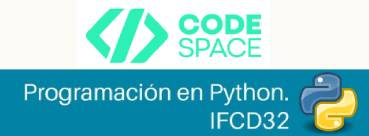

  

<strong>Calendario de Clases — Python</strong> 
Duración total: 150 horas · 6 semanas (30 días lectivos) 
Horario de clases en directo: 16:00–18:30 

<strong>Semana 1 — 06/04 al 10/04/2026</strong> 

<ul>
  <li>Lunes 06/04/2026 · 16:00–18:30 · Clase en directo</li>
</ul>

  Introducción a la programación, algoritmos y lógica básica.

<ul>
  <li>Martes 07/04/2026 · 16:00–18:30 · Clase en directo</li>
</ul>

  Arquitectura del ordenador, ejecución de programas e instalación del entorno Python.

<ul>
  <li>Jueves 09/04/2026 · 16:00–18:30 · Clase en directo</li>
</ul>

  Sintaxis básica, entrada y salida de datos y buenas prácticas iniciales.

<ul>
  <li>Viernes 10/04/2026 · 16:00–18:30 · Clase en directo</li>
</ul>

  Variables, tipos de datos y conversión entre tipos.

<strong>Semana 2 — 13/04 al 17/04/2026</strong> 

<ul>
  <li>Lunes 13/04/2026 · 16:00–18:30 · Clase en directo</li>
</ul>

  Operadores aritméticos, lógicos y construcción de expresiones.

<ul>
  <li>Martes 14/04/2026 · 16:00–18:30 · Clase en directo</li>
</ul>

  Estructuras condicionales y toma de decisiones en código.

<ul>
  <li>Jueves 16/04/2026 · 16:00–18:30 · Clase en directo</li>
</ul>

  Bucles, control de flujo y depuración básica.

<ul>
  <li>Viernes 17/04/2026 · 16:00–18:30 · Clase en directo</li>
</ul>

  Manipulación y formateo de cadenas de texto.

<strong>Semana 3 — 20/04 al 24/04/2026</strong> 

<ul>
  <li>Lunes 20/04/2026 · 16:00–18:30 · Clase en directo</li>
</ul>

  Listas y tuplas, métodos principales e iteración.

<ul>
  <li>Martes 21/04/2026 · 16:00–18:30 · Clase en directo</li>
</ul>

  Diccionarios, conjuntos y conversión entre estructuras.

<ul>
  <li>Jueves 23/04/2026 · 16:00–18:30 · Clase en directo</li>
</ul>

  Definición de funciones, parámetros y valores de retorno.

<ul>
  <li>Viernes 24/04/2026 · 16:00–18:30 · Clase en directo</li>
</ul>

  Recursividad, funciones lambda y generadores.

<strong>Semana 4 — 27/04 al 01/05/2026</strong> 

<ul>
  <li>Lunes 27/04/2026 · 16:00–18:30 · Clase en directo</li>
</ul>

  Modularidad, creación de módulos y decoradores básicos.

<ul>
  <li>Martes 28/04/2026 · 16:00–18:30 · Clase en directo</li>
</ul>

  Introducción a POO, clases, objetos y métodos.

<ul>
  <li>Jueves 30/04/2026 · 16:00–18:30 · Clase en directo</li>
</ul>

  Constructores, encapsulamiento y métodos especiales.

<strong>Semana 5 — 04/05 al 08/05/2026</strong> 

<ul>
  <li>Lunes 04/05/2026 · 16:00–18:30 · Clase en directo</li>
</ul>

  Herencia, polimorfismo y aplicación práctica de POO.

<ul>
  <li>Martes 05/05/2026 · 16:00–18:30 · Clase en directo</li>
</ul>

  Manejo de excepciones y control de errores.

<ul>
  <li>Jueves 07/05/2026 · 16:00–18:30 · Clase en directo</li>
</ul>

  Programación defensiva, testing y refactorización básica.

<ul>
  <li>Viernes 08/05/2026 · 16:00–18:30 · Clase en directo</li>
</ul>

  Lectura y escritura de archivos (CSV y JSON).

<strong>Semana 6 — 11/05 al 15/05/2026</strong> 

<ul>
  <li>Lunes 11/05/2026 · 16:00–18:30 · Clase en directo</li>
</ul>

  Introducción a bases de datos y operaciones CRUD con SQLite.

<ul>
  <li>Martes 12/05/2026 · 16:00–18:30 · Clase en directo</li>
</ul>

  Fundamentos web y primera aplicación con Flask.

<ul>
  <li>Jueves 14/05/2026 · 16:00–18:30 · Clase en directo</li>
</ul>

  Control de versiones con Git y uso de GitHub.

<ul>
  <li>Viernes 15/05/2026 · 16:00–18:30 · Clase en directo</li>
</ul>

  Repaso general y examen final.

<strong>Trabajo en plataforma</strong> 
Sesiones de teleformación online realizadas los miércoles, en horario 16:00–21:00. 

<ul>
  <li>Miércoles 08/04/2026 · 16:00–21:00 · Teleformación online</li>
</ul>

  Trabajo completo de variables, operadores y estructuras de control (condicionales y bucles) aplicado a casos reales. Ejercicios progresivos guiados y práctica intensiva con depuración básica de errores y resolución de problemas.

<ul>
  <li>Miércoles 15/04/2026 · 16:00–21:00 · Teleformación online</li>
</ul>

  Desarrollo profundo de diccionarios y conjuntos, incluyendo manipulación avanzada y conversión entre estructuras de datos. Resolución de ejercicios integradores orientados a gestión de información y mini-reto práctico con datos estructurados.

<ul>
  <li>Miércoles 22/04/2026 · 16:00–21:00 · Teleformación online</li>
</ul>

  Programación funcional en Python: funciones lambda, generadores y comprensión de listas aplicadas a casos prácticos. Introducción a decoradores y ejercicio integrador combinando funciones avanzadas, modularidad y reutilización de código.

<ul>
  <li>Miércoles 29/04/2026 · 16:00–21:00 · Teleformación online</li>
</ul>

  Aplicación completa de Programación Orientada a Objetos: herencia, encapsulamiento y polimorfismo en un caso práctico real. Desarrollo de mini-proyecto estructurado con diseño de clases, validaciones y buenas prácticas.

<ul>
  <li>Miércoles 06/05/2026 · 16:00–21:00 · Teleformación online</li>
</ul>

  Introducción sólida a bases de datos: fundamentos relacionales y no relacionales, modelo entidad-relación y lenguaje SQL. Conexión a SQLite desde Python, creación de tablas y desarrollo de operaciones CRUD con práctica aplicada.

<ul>
  <li>Miércoles 13/05/2026 · 16:00–21:00 · Teleformación online</li>
</ul>

  Desarrollo web con Python utilizando Flask: estructura de proyecto, rutas, templates y manejo de formularios. Integración con bases de datos, pruebas funcionales básicas y despliegue local de una aplicación completa.

